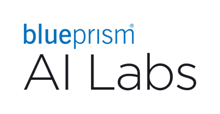

## Authors

Alexander Kuhnle, Miguel Aroca-Ouellette, John Reid, Dell Zhang, Murat Sensoy

_{alexander.kuhnle, miguel.aroca, john.reid, dell.zhang, murat.sensoy}[at]blueprism[dot]com_

## Description

There is strong interest in leveraging reinforcement learning (RL) for information retrieval (IR) applications including search, recommendation, and advertising. Just in 2020, the term "reinforcement learning" was mentioned in more than 60 different papers published by ACM SIGIR. It has also been reported that Internet companies like Google and Alibaba have started to gain competitive advantages from their RL-based search and recommendation engines. This full-day tutorial gives IR researchers and practitioners who have no or little experience with RL the opportunity to learn about the fundamentals of modern RL in a practical hands-on setting. Furthermore, some representative applications of RL in IR systems will be introduced and discussed. By attending this tutorial, the participants will acquire a good knowledge of modern RL concepts and standard algorithms such as REINFORCE and DQN. This knowledge will help them better understand some of the latest IR publications involving RL, as well as prepare them to tackle their own practical IR problems using RL techniques and tools.

This tutorial has been part of the [European Conference on Information Retrieval (ECIR) 2021](https://www.ecir2021.eu/tutorials/) and [Search Solutions 2020](https://irsg.bcs.org/SearchSolutions/2020/ss2020tutorials.php).

## Material

The complete repository for this tutorial can be found at [RL Starterpack](https://github.com/RL-Starterpack/rl-starterpack/).

### Quick Links:

* [RL Slides](https://github.com/RL-Starterpack/rl-starterpack/blob/main/slides/RL_Tutorial.pdf)
* [RL For IR Slides](https://github.com/RL-Starterpack/rl-starterpack/blob/main/slides/RL_Tutorial_IR.pdf)
* [TQL Exercise](https://github.com/RL-Starterpack/rl-starterpack/blob/main/exercises/TQL.ipynb)
* [DQN Exercise](https://github.com/RL-Starterpack/rl-starterpack/blob/main/exercises/DQN.ipynb)
* [PG Exercise](https://github.com/RL-Starterpack/rl-starterpack/blob/main/exercises/PG.ipynb)
* [AC Exercise](https://github.com/RL-Starterpack/rl-starterpack/blob/main/exercises/AC.ipynb)

## Schedule

The ECIR 2021 tutorial is taking place on March 28th, 2021.
All times below are in BST (UTC+1).

* 08:00-09:00  RL Basics and Tabular Q-Learning
* 09:00-09:30  Deep Q-Network (DQN) 1/2 (presentation)
* 09:30-10:00  Coffee Break
* 10:00-10:30  Deep Q-Network (DQN) 2/2 (hands-on)
* 10:30-11:15  IR Applications using DQN
* 11:15-13:15  Lunch Break (45 minutes extra)
* 13:15-14:15  Policy Gradient (REINFORCE)
* 14:15-15:15  IR Applications using REINFORCE
* 15:15-15:45  Coffee Break
* 15:45-16:15  Actor Critic
* 16:15-16:45  Outlook
* 16:45-17:15  Final Q&A

## Contact

Questions? Feedback? Please reach out to one of the tutorial organisers using the emails listed at the top of this page.

## Additional Resources

##### Introductory Material

- [Spinning Up in Deep RL (OpenAI)](https://spinningup.openai.com/en/latest/index.html)
- [Deep Reinforcement Learning Course (Thomas Simonini)](https://simoninithomas.github.io/Deep_reinforcement_learning_Course/)
- [Simple Reinforcement Learning with Tensorflow (Arthur Juliani)](https://medium.com/emergent-future/simple-reinforcement-learning-with-tensorflow-part-0-q-learning-with-tables-and-neural-networks-d195264329d0)
- [Deep Reinforcement Learning: Pong from Pixels (Andrej Karpathy)](http://karpathy.github.io/2016/05/31/rl/)
- [An Outsider's Tour of Reinforcement Learning (Ben Recht)](http://www.argmin.net/2018/06/25/outsider-rl/)
- Lilian Weng:
    - [A (Long) Peek into Reinforcement Learning](https://lilianweng.github.io/lil-log/2018/02/19/a-long-peek-into-reinforcement-learning.html)
    - [Policy Gradient Algorithms](https://lilianweng.github.io/lil-log/2018/04/08/policy-gradient-algorithms.html)
    - [Implementing Deep Reinforcement Learning Models with Tensorflow + OpenAI Gym](https://lilianweng.github.io/lil-log/2018/05/05/implementing-deep-reinforcement-learning-models.html)
    - and more...

##### Critical Voices

- [Deep Reinforcement Learning Doesn't Work Yet (Alex Irpan)](https://www.alexirpan.com/2018/02/14/rl-hard.html)
- [The Policy of Truth (Ben Recht)](http://www.argmin.net/2018/02/20/reinforce/)
- [Lessons Learned Reproducing a Deep Reinforcement Learning Paper (Amid Fish)](http://amid.fish/reproducing-deep-rl)

##### Books

- [Reinforcement Learning - An Introduction (Sutton & Barto, 2018)](http://incompleteideas.net/book/RLbook2020.pdf)
- [An Introduction to Deep Reinforcement Learning (Francois-Lavet et al., 30 Nov 2018)](https://arxiv.org/abs/1811.12560)
